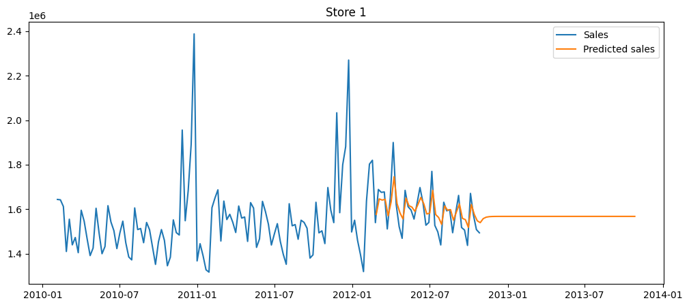
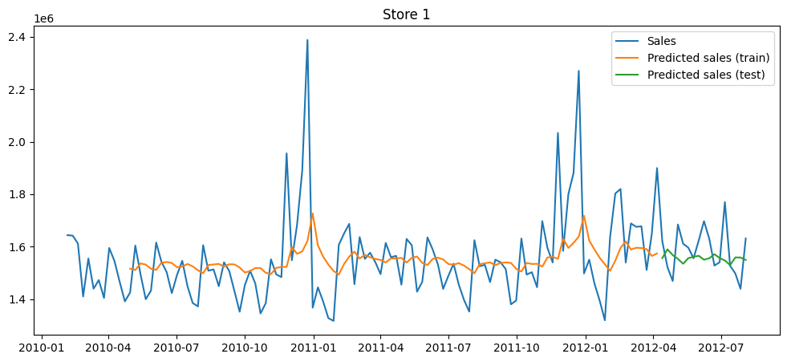
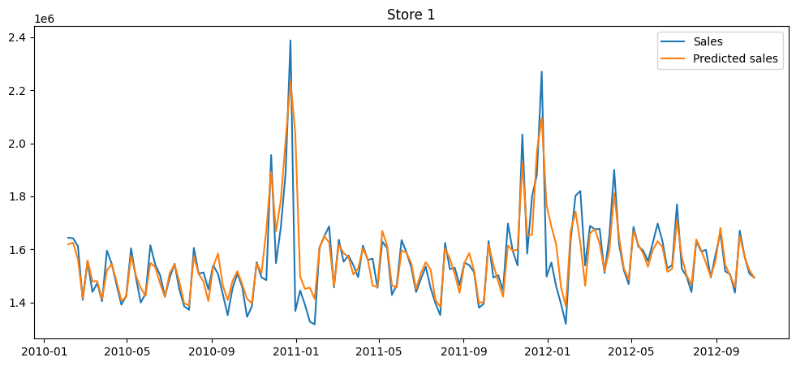

# Previsão e análise das vendas do Walmart

O objetivo deste projeto é treinar a aplicação de diferentes modelos de machine learning com Python para previsão de dados.

## Obtenção dos dados

O dataset utilizado neste projeto foi obtido no [Kaggle](https://www.kaggle.com/datasets/mikhail1681/walmart-sales) e é composto por dados de vendas por semana entre 2010 e 2012 para 45 lojas do Walmart. Além das vendas, o dataset também dispões de variáveis externas como a ocorrência de feriados, temperatura do ar no local da loja, preço do combustível, inflação e taxa de desemprego.

## Ajuste dos modelos de previsão

### Modelos de previsão por séries temporais

Foram ajustados dois modelos de previsão por séries temporais: ARIMA e RNN. A performance de ambos os modelos foi bem fraca, como apresentados nos gráficos abaixo.

**Resultados prévios do ARIMA**



**Resultados prévios do RNN**



Uma possível solução para aprimorar ambos os modelos é a aplicação de técnicas de otimização para seus hiperparâmetros.

### Modelo de regressão

Uma outra estratégia testada foi utilizar as demais variáveis para prever as vendas. Para representar a data, foram criadas as seguintes colunas no dataset: ano, trimestre, mês, dia do ano, dia do mês, dia da semana, semana do mês e semana do ano. Além disso, foi aplicada a técnica de One Hot Encoding na coluna de loja para transformar esta variável categórica em um conjunto de variáveis dicotômicas. Ao final destes passos, o dataset possuía 58 variáveis independentes, listadas abaixo.

```
['Holiday_Flag', 'Temperature', 'Fuel_Price', 'CPI', 'Unemployment', 'year', 'quarter', 'month', 'dayOfYear', 'day', 'weekday','weekOfMonth', 'weekOfYear', 'Store_1', 'Store_2', 'Store_3', 'Store_4', 'Store_5', 'Store_6', 'Store_7', 'Store_8', 'Store_9', 'Store_10', 'Store_11', 'Store_12', 'Store_13', 'Store_14', 'Store_15', 'Store_16', 'Store_17', 'Store_18', 'Store_19', 'Store_20', 'Store_21', 'Store_22', 'Store_23', 'Store_24', 'Store_25', 'Store_26', 'Store_27', 'Store_28', 'Store_29', 'Store_30', 'Store_31', 'Store_32', 'Store_33', 'Store_34', 'Store_35', 'Store_36', 'Store_37', 'Store_38', 'Store_39', 'Store_40', 'Store_41', 'Store_42', 'Store_43', 'Store_44', 'Store_45']
```

O algoritmo escolhido para treinamento foi o Random Forest que, com 1000 estimadores, apresentou uma performance impressionante medida pelas seguintes métricas:

- **MAPE** = 0.0475
- **R²** = 0.9595

A imagem abaixo ilustra a performance deste modelo



## Visualização dos dados usando Power BI

O dataset foi importado para o Power BI e, sem a necessidade de grandes processamentos, foi construído um dashboard para visualizar os dados de forma estratégica e analítica, evidenciando as lojas com maior e menor volume de vendas e fazendo uma comparação entre os anos. A imagem abaixo ilustra o dashboard construído em Power BI:


